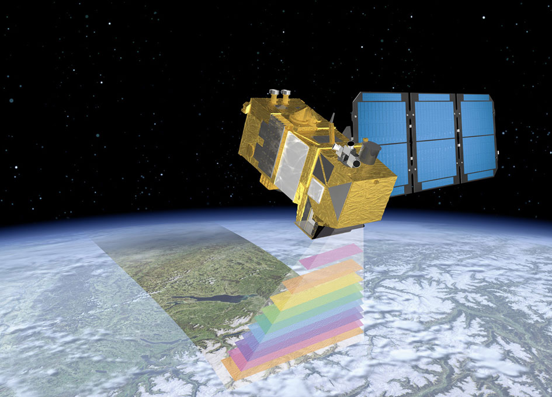
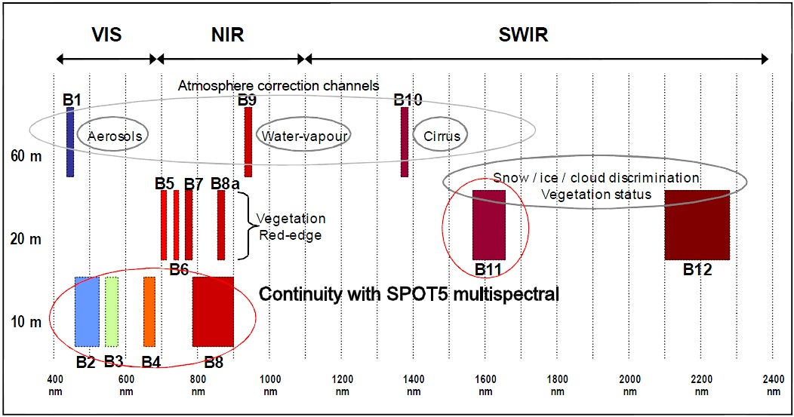
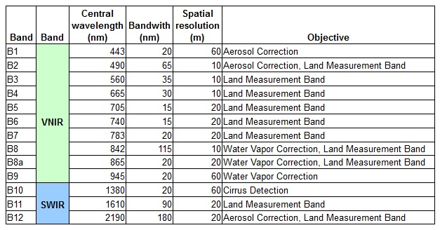
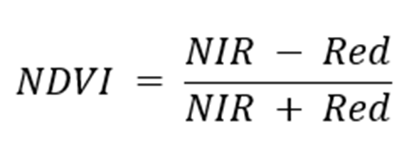
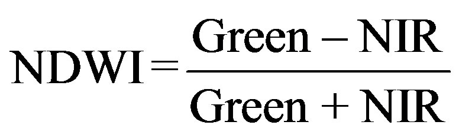

# Application of R in Remote Sensing

This is an [R Markdown](http://rmarkdown.rstudio.com/) notebook which illustrates how to read, subset, and process a Sentinel-2 multispectral image in R.



## **Introduction**

As the world is facing a wide variety of challenges, reliable information is required to assist and help in the decision-making process. Different methods can be used to gather it but satellite Earth Observation offers a suitable approach based on the coverage and type of data that are provided.

Reliable information on agriculture and crops is required to assist and help in the decision-making process of different applications. Different methods can be used to gather this information, but satellite earth observation offers a suitable approach based on the coverage and type of data that are provided.

A few years ago, the European Union (EU) started an ambitious program, Copernicus, which includes the launch of a new family of earth observation satellites known as the Sentinels. Amongst other applications, this new generation of remote sensing satellites will improve the observation, identification, mapping, assessment, and monitoring of crop dynamics at a range of spatial and temporal resolutions.

***In this tutorial***, we will process Senitnel-2 with **R** to analyze the **dynamics of vegetation**.

The exercise is divided in the following sections:

1.  Load R packages

2.  Load Auxiliary Data required for this exercise

3.  Load Sentinel-2 data

4.  Sentinel-2 data processing

    • Subset

    • Derive NDVI

    • Extract pixel value

    • Plot temporal series

    ## [1. Load R package]{.underline}

    In a new code cell copy-paste the following code to start analyzing the Sentinel-2 products. We start first by loading the R packages needed for this processing. If not installed, they will be installed. After that, we set the working directory the our AuxData folder.

```{r}
rm(list=ls())
# Load R packages
pck <- (c("tidyr","rgdal","ggplot2","raster","leaflet","rasterVis","gridExtra","RColorBrewer","plotly","sen2r","geojsonlint"))
new_pck <- pck[!pck %in% installed.packages()[,"Package"]]
if(length(new_pck)){install.packages(new_pck)}

sapply(pck, require, character.only=TRUE)

setwd("/Users/mostafa/Desktop/Github/RS/ProS2L2A")

```


+------------------+-------------------------------------------------------------------+---------------------------------------------------------------------------------------------------------------------------------------------------------------------------+
| Packages         | Name                                                              | Description                                                                                                                                                               |
+==================+===================================================================+===========================================================================================================================================================================+
| ### tidyr        | Tidy Messy Data                                                   | Tools to help to create tidy data, where each column is a variable, each row is an observation, and each cell contains a single value.                                    |
+------------------+-------------------------------------------------------------------+---------------------------------------------------------------------------------------------------------------------------------------------------------------------------+
| ### rgdal        | Bindings for the 'Geospatial' Data Abstraction Library            | Provides bindings to the 'Geospatial' Data Abstraction Library                                                                                                            |
+------------------+-------------------------------------------------------------------+---------------------------------------------------------------------------------------------------------------------------------------------------------------------------+
| ### ggplot2      | Create Elegant Data Visualisations Using the Grammar of Graphics  | A system for 'declaratively' creating graphics, based on "The Grammar of Graphics".                                                                                       |
+------------------+-------------------------------------------------------------------+---------------------------------------------------------------------------------------------------------------------------------------------------------------------------+
| ### raster       | Geographic Data Analysis and Modeling                             | Reading, writing, manipulating, analyzing and modeling of spatial data.                                                                                                   |
+------------------+-------------------------------------------------------------------+---------------------------------------------------------------------------------------------------------------------------------------------------------------------------+
| ### leaflet      | Create Interactive Web Maps with the JavaScript 'Leaflet' Library | Create and customize interactive maps using the 'Leaflet' JavaScript library and the 'htmlwidgets' package.                                                               |
+------------------+-------------------------------------------------------------------+---------------------------------------------------------------------------------------------------------------------------------------------------------------------------+
| ### rasterVis    | Visualization Methods for Raster Data                             | Methods for enhanced visualization and interaction with raster data.                                                                                                      |
+------------------+-------------------------------------------------------------------+---------------------------------------------------------------------------------------------------------------------------------------------------------------------------+
| ### gridExtra    | Miscellaneous Functions for "Grid" Graphics                       | Provides a number of user-level functions to work with "grid" graphics, notably to arrange multiple grid-based plots on a page, and draw tables.                          |
+------------------+-------------------------------------------------------------------+---------------------------------------------------------------------------------------------------------------------------------------------------------------------------+
| ### RColorBrewer | ColorBrewer Palettes                                              | Provides color schemes for maps (and other graphics) designed by Cynthia Brewer as described at [http://colorbrewer2.org](http://colorbrewer2.org/).                      |
+------------------+-------------------------------------------------------------------+---------------------------------------------------------------------------------------------------------------------------------------------------------------------------+
| ### plotly       | Create Interactive Web Graphics via 'plotly.js'                   | Create interactive web graphics from 'ggplot2' graphs and/or a custom interface to the (MIT-licensed) JavaScript library 'plotly.js' inspired by the grammar of graphics. |
+------------------+-------------------------------------------------------------------+---------------------------------------------------------------------------------------------------------------------------------------------------------------------------+
| ### sen2r        | Find, Download and Process Sentinel-2 Data                        | Functions to download Sentinel-2 optical images and perform preliminary processing operations.                                                                            |
+------------------+-------------------------------------------------------------------+---------------------------------------------------------------------------------------------------------------------------------------------------------------------------+
| ### GeoJSON      | Tools for Validating 'GeoJSON'                                    | Tools for linting 'GeoJSON'.                                                                                                                                              |
+------------------+-------------------------------------------------------------------+---------------------------------------------------------------------------------------------------------------------------------------------------------------------------+

: Packages Description

## Sentinel-2

The Copernicus Sentinel-2 mission comprises a constellation of two polar-orbiting satellites placed in the same sun-synchronous orbit, phased at 180° to each other. It aims at monitoring variability in land surface conditions, and its wide swath width (290 km) and high revisit time (10 days at the equator with one satellite, and 5 days with 2 satellites under cloud-free conditions which results in 2-3 days at mid-latitudes) will support monitoring of Earth's surface changes.



{width="709"}

## Provide Time Series Data

```{r}
library(sen2r)
sen2r()
```

first of all in Product selection, select RAW files and then connect to your SciHub account. Also, you can filter your data based on cloud cover (Max.SAFE cloud cover). (proper value is 25%)


Then choose Spatial-Temporal selection


## Processing (Atmospheric correction)

Sen2Cor is a processor for Sentinel-2 Level 2A product generation and formatting; it performs the atmospheric-, terrain and cirrus correction of Top-Of- Atmosphere Level 1C input data. Sen2Cor creates Bottom-Of-Atmosphere, optionally terrain- and cirrus corrected reflectance images; additional, Aerosol Optical Thickness-, Water Vapor-, Scene Classification Maps and Quality Indicators for cloud and snow probabilities. Its output product format is equivalent to the Level 1C User Product: JPEG 2000 images, three different resolutions, 60, 20 and 10 m.


-   Convert Sentinel-2 L1C to L2A (Using sen2cor plugin)

{.uri}](images/Screen%20Shot%202022-08-14%20at%2021.31.33.png)

## Select Study Area and points

```{r}
Study_Area<-readOGR("/Users/mostafa/Desktop/Github/RS/SA1/StudyArea/SA/saa.shp")
point_SA<-readOGR("/Users/mostafa/Desktop/Github/RS/SA1/StudyArea/point/points.shp")
```

### Show the Study Area

```{r}
#Mapping
Study_Area2 <- spTransform(Study_Area, CRS("+proj=longlat +datum=WGS84"))

m <- leaflet(sizingPolicy = leafletSizingPolicy(defaultHeight = 200, viewer.suppress = TRUE, knitr.figure=FALSE)) %>%
  addProviderTiles(providers$Esri.WorldStreetMap) %>%  #providers$Esri.NatGeoWorldMap
  addPolygons(data = Study_Area2,
              stroke = FALSE,
              smoothFactor = 0.5
  )
m
```

## Load Data

1.  select folder with all Sentinel-2 data (all days). [S2 \<- "/Users/mostafa/Desktop/Github/RS/S2L2A"]

    

2.  After correction of L1C data using sen2cor plugin if open S2B_MSIL2A_20220813T072619_N9999_R049_T39RTQ_20220815T104133.SAFE/GRANULE/L2A_T39RTQ_A028389_20220813T073150/IMG_DATA/R10m you can see [T39RTQ_20220813T072619\_\*\*B08_10m.jp2], [**T39RTQ_20220813T072619\_**B03_10m.jp2], ...\*\* which the **Bold** parts are not repetitive. We separate this part using pattern function [**pattern = "B0[2348]\_10m.jp2\$**] and all bands (B3, B3, B4, B8) will selected for analyzing.

    

```{r}
#Load data
S2 <- "/Users/mostafa/Desktop/Github/RS/S2L2A"
S2 <- list.files(S2, recursive = TRUE, full.names = TRUE, pattern = "B0[2348]_10m.jp2$")
S2 <- lapply(1:length(S2), function (x) {raster(S2[x])})
S2[1]
```

Stack all bands and demonstrate study area in true color (**red**=Red band, **g**= green band, **b**=Blue band) and false color (**red**=NIR band, **g**= Red band, **b**=Green band).

```{r}
#set layout
options(repr.plot.width=41, repr.plot.height=20)
m <- rbind(c(1,2))
layout(m)

#Stack
S2_stack <- stack(S2)

#plot True/False Color
plotRGB(S2_stack, r=3, g=2, b=1, scale=maxValue(S2[[2]]), stretch='hist') #stretch='lin'
plot(Study_Area, add=TRUE, border='yellow', lwd=5)
plotRGB(S2_stack, r=4, g=3, b=2, scale=maxValue(S2[[2]]), stretch='hist') #stretch='lin'
plot(Study_Area, add=TRUE, border='yellow', lwd=5)
```


Crop data according the study area .shp file.

```{r}
#Set layout
options(repr.plot.width = 35, repr.plot.height = 10)
m <- rbind(c(1, 2))
layout(m)
#crop and plot
S2_stack_crop <- crop(S2_stack, Study_Area)
plotRGB(S2_stack_crop, r=3, g=2, b=1, scale=maxValue(S2[[2]]), stretch='hist')
plotRGB(S2_stack_crop, r=4, g=3, b=2, scale=maxValue(S2[[2]]), stretch='hist')
```


## Derive NDVI (**Normalized Difference Vegetation Index)**

The **normalized difference vegetation index** (**NDVI**) is a simple graphical indicator that can be used to analyze [remote sensing](https://en.wikipedia.org/wiki/Remote_sensing "Remote sensing")measurements, often from a [space platform](https://en.wikipedia.org/wiki/Artificial_satellite "Artificial satellite"), assessing whether or not the target being observed contains live green [vegetation](https://en.wikipedia.org/wiki/Vegetation "Vegetation").

{width="190"}

```{r}
#Derive NDVI
NDVI<-list()

for (i in 1:(length(S2)/4)) {
  NDVI[[i]] <- overlay(S2_stack_crop[[((i-1)*4+3)]], S2_stack_crop[[((i-1)*4+4)]], fun=function(x,y) (y-x) / (y+x))
  names(NDVI[[i]]) <- paste0("NDVI_", strsplit(strsplit(names(S2_stack_crop[[(i-1)*4+4]]), "_")[[1]][2], "T")[[1]][1])
}
NDVI
```

## Derive NDWI (**Normalized Difference Water Index)**

The **Normalized Difference Water Index** (NDWI) is known to be strongly related to the plant water content. It is therefore a very good proxy for plant water stress. The Normalized Difference Water Index (NDWI) (Gao, 1996) is a satellite-derived index from the Near-Infrared (NIR) and Short Wave Infrared (SWIR) channels.

{width="193"}

```{r}
#Derive NDWI
NDWI<-list()

for (i in 1:(length(S2)/4)) {
  NDWI[[i]] <- overlay(S2_stack_crop[[((i-1)*4+4)]], S2_stack_crop[[((i-1)*4+2)]], fun=function(x,y) (y-x) / (y+x))
  names(NDWI[[i]]) <- paste0("NDWI_", strsplit(strsplit(names(S2_stack_crop[[(i-1)*4+4]]), "_")[[1]][2], "T")[[1]][1])
}
NDWI
```

## show all Plot NDWI\\NDVI and Points of reference


```{r}
#Set Layout
options(repr.plot.width = 100, repr.plot.height = 90)

#plot
breaks <- c(-1, -0.8, -0.6, -0.4, -0.2, 0, 0.2, 0.4, 0.6, 0.8, 1)
pal <- brewer.pal(11,"RdYlGn") #https://r-graph-gallery.com/38-rcolorbrewers-palettes.html
mapTheme <- rasterTheme(region = pal)
mapTheme$fontsize$text = 9
```

```{r}
#Plot NDWI\NDVI and Points of reference
levelplot(stack(NDVI), scales=list(draw=FALSE), colorkey=FALSE, par.settings=mapTheme)
```


## Extract pixel value at point coord

```{r}
#Extract pixel value at point coord
NDVI_points <- lapply(NDVI, FUN=function (NDVI) {raster::extract(NDVI, point_SA, method = 'bilinear', df=TRUE)})
NDVI_points
```

```{r}
#Combine df
NDVI_points_df <- do.call("cbind", NDVI_points)

#Clean df - remove duplicated columns
NDVI_points_df <- NDVI_points_df[, !duplicated(colnames(NDVI_points_df))]
NDVI_points_df
```


```{r}
#Arrange df
NDVI_points_df <-gather(NDVI_points_df, key = Date, value = value, -ID)
NDVI_points_df
```

{width="276"}

## Plot NDVI Temporal series

```{r}
#plot NDVI Temporal series
ndvi_plot <- ggplot(data=NDVI_points_df, aes(x=Date, y=value, group=ID, color=ID)) + geom_line() + geom_point()
ndvi_plot
```


